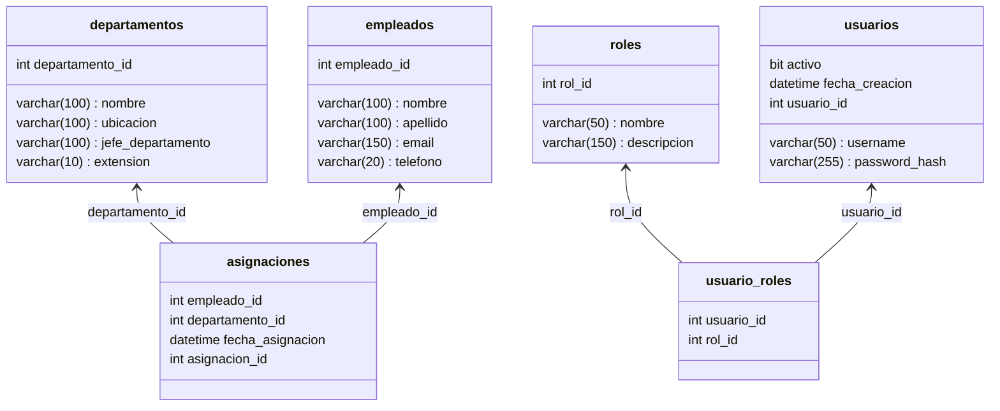

```mermaid
classDiagram
direction BT
class asignaciones {
   int empleado_id
   int departamento_id
   datetime fecha_asignacion
   int asignacion_id
}
class departamentos {
   varchar(100) nombre
   varchar(100) ubicacion
   varchar(100) jefe_departamento
   varchar(10) extension
   int departamento_id
}
class empleados {
   varchar(100) nombre
   varchar(100) apellido
   varchar(150) email
   varchar(20) telefono
   int empleado_id
}
class roles {
   varchar(50) nombre
   varchar(150) descripcion
   int rol_id
}
class usuario_roles {
   int usuario_id
   int rol_id
}
class usuarios {
   varchar(50) username
   varchar(255) password_hash
   bit activo
   datetime fecha_creacion
   int usuario_id
}

asignaciones  -->  departamentos : departamento_id
asignaciones  -->  empleados : empleado_id
usuario_roles  -->  roles : rol_id
usuario_roles  -->  usuarios : usuario_id
```